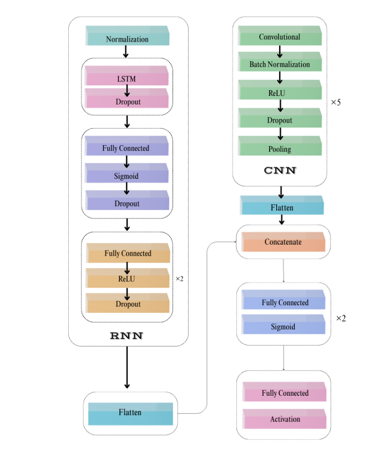
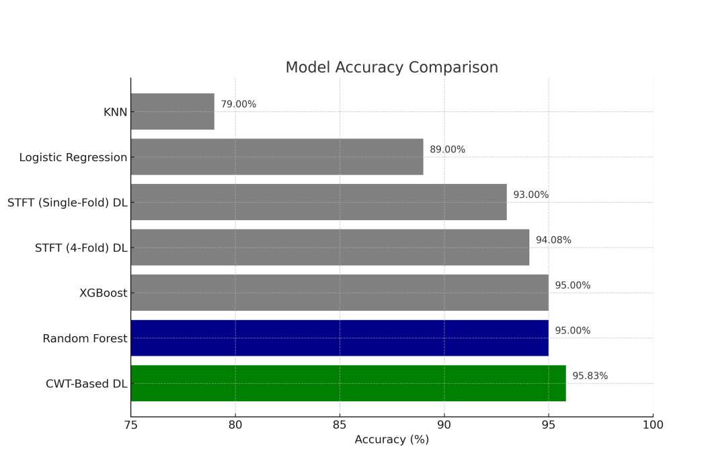

# Deep Learning Based EEG Signal Analysis for Detection of Epileptic Seizures

## 🧠 Project Overview

This repository hosts the code and documentation for our MSc research project on **epileptic seizure detection using EEG signals**. The project proposes a **hybrid dual-path PCNN–LSTM model** that combines:

- **CNN** for spatial feature extraction from spectrograms (STFT) and scalograms (CWT)
- **LSTM** for capturing temporal dependencies from raw EEG time series

### 🔍 Key Features
- Achieved **95.83% test accuracy** and **AUC ≈ 0.99**
- Dual input: time-series + time-frequency transformed EEG
- Evaluated on **Bonn University EEG dataset**
- Compared with SVM, KNN, XGBoost, Random Forest, Logistic Regression

---

## 🧠 Architecture

The model integrates both CNN and LSTM branches in parallel, processing spectrogram/scalogram images and raw EEG data respectively, followed by feature fusion and final classification.

---

## 📊 Performance Comparison

The proposed PCNN–LSTM model outperformed traditional ML models and standalone deep models. Below is the comparison:

| Model                     | Accuracy (%) | AUC    | Precision | Recall | F1 Score |
|--------------------------|--------------|--------|-----------|--------|----------|
| **CWT-PCNN–LSTM**         | 95.83        | 0.99   | 0.98      | 0.80   | 0.89     |
| STFT-PCNN–LSTM           | 94.08        | 0.97   | 0.89      | 0.87   | 0.86     |
| Random Forest            | 95.00        | —      | —         | —      | —        |
| XGBoost                  | 95.00        | —      | —         | —      | —        |
| Logistic Regression      | 89.00        | —      | —         | —      | —        |
| K-Nearest Neighbors      | 79.00        | —      | —         | —      | —        |

---

## 📂 Dataset

- **Bonn University EEG Dataset**
- 5 categories: Set A–E (Normal, Interictal, Ictal)
- Transformed using STFT and CWT
- Signals segmented into 256-sample chunks for training

---

## 🚀 Technologies Used

- Python
- PyTorch / TensorFlow (choose whichever you used)
- Matplotlib, NumPy, Scikit-learn
- STFT / CWT for signal transformation
- CNNs and LSTMs for classification

---

